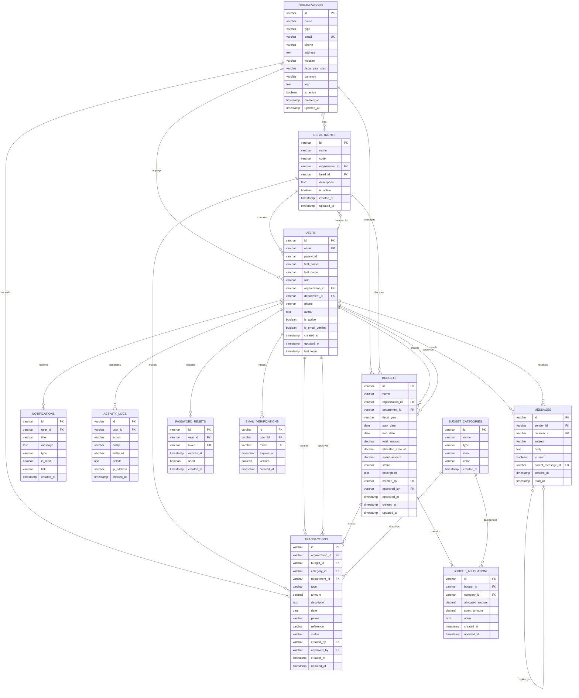

# BudMap Database Schema

## Overview
This diagram shows the complete database structure for BudMap with all 12 tables and their relationships.

## Key Relationships

### Organization Hierarchy
- **Organizations** → **Departments** → **Users**
- Each organization can have multiple departments
- Each department belongs to one organization
- Users are assigned to both organizations and departments

### Budget Flow
- **Budgets** are created at organization or department level
- **Budget Allocations** distribute budget across categories
- **Transactions** record actual spending against budgets
- All spending is tracked and categorized

### User Management
- Users have roles (admin, finance_officer, department_head, viewer)
- Department heads are linked back to departments
- Users create and approve budgets and transactions
- Activity is logged in activity_logs

### Communication & Notifications
- **Notifications** alert users about important events
- **Messages** enable internal communication
- Messages can be threaded (reply to messages)

### Security & Recovery
- **Password Resets** handle password recovery tokens
- **Email Verifications** manage email confirmation
- Both use token-based systems with expiration

## Table Details

### Core Tables (6)
1. **organizations** - Base entity for all operations
2. **departments** - Organizational structure
3. **users** - User accounts and authentication
4. **budget_categories** - Classification system
5. **budgets** - Budget planning and tracking
6. **transactions** - Financial transactions

### Support Tables (6)
7. **budget_allocations** - Budget distribution
8. **notifications** - User alerts
9. **activity_logs** - Audit trail
10. **messages** - Internal messaging
11. **password_resets** - Password recovery
12. **email_verifications** - Email confirmation

## Features

### Data Integrity
- Foreign key constraints ensure referential integrity
- Cascade deletes where appropriate
- Set NULL for optional references

### Performance
- Indexes on all foreign keys
- Indexes on frequently queried fields
- Connection pooling for efficiency

### Audit Trail
- created_at and updated_at on all main tables
- Automatic timestamp updates via triggers
- Complete activity logging

### Flexibility
- Department-level or organization-level budgets
- Multiple budget periods (fiscal years)
- Hierarchical message threading
- Multi-category budget allocations
